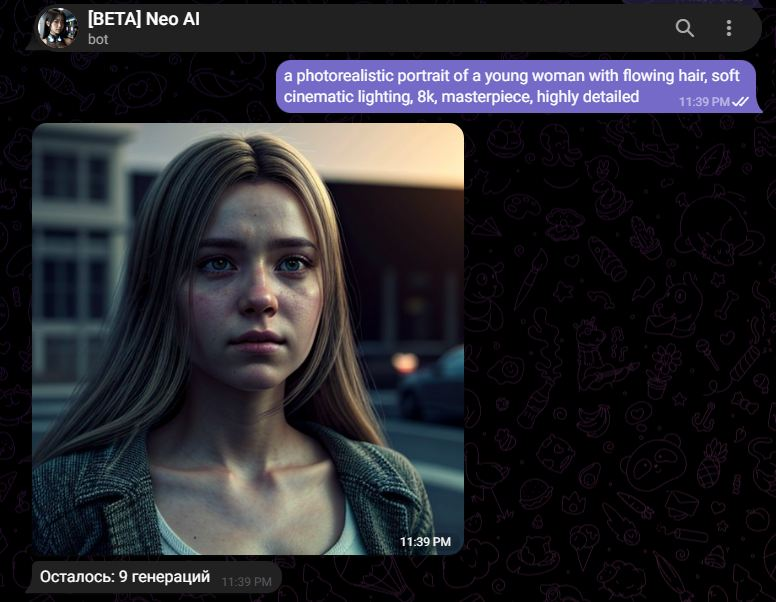
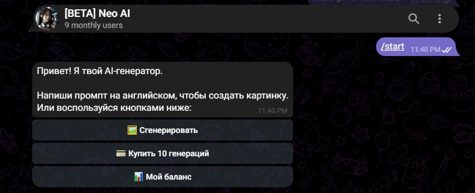
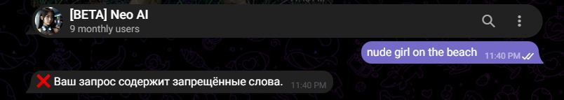
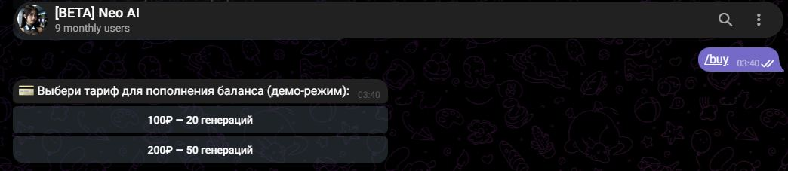

# AI Image Generator Telegram Bot 🤖🎨

A fully containerized Telegram bot that generates high-quality photorealistic images using a local Stable Diffusion instance. Designed as a portfolio project to demonstrate backend engineering, API integration, and database management skills.

## 🚀 Key Features

- **Text-to-Image Generation**: Accepts any detailed prompt in English and returns a photorealistic image within seconds.
- **User Balance System**: Built-in SQLite database tracks user credits. New users receive 5 free generations automatically.
- **Simulated In-App Purchases**: The `/buy` command adds 10 credits to the user's balance, simulating a payment integration flow.
- **Strict Content Moderation**: Combines multi-layer NSFW filtering and age-restricted keyword blocking to ensure safe usage and prevent policy violations.
- **Dockerized Deployment**: The application runs entirely inside a Docker container, ensuring a consistent and portable environment.
- **Persistent Data Storage**: Utilizes Docker volumes to persist the SQLite database (`users.db`) across container restarts.

## 🛠️ Tech Stack

- **Language**: Python 3.13 (asyncio)
- **Framework**: `python-telegram-bot` (Async)
- **Containerization**: Docker
- **Database**: SQLite3
- **AI Backend**: Stable Diffusion WebUI (Forge) via HTTP API
- **HTTP Client**: `aiohttp` for async API calls

## 📂 Architecture

The bot acts as a wrapper between the user interface (Telegram) and the AI inference engine (Stable Diffusion).
1. User sends a prompt via Telegram.
2. Bot verifies the user's balance and checks the prompt against strict moderation filters.
3. Bot forwards the sanitized prompt to the local Stable Diffusion API (`http://host.docker.internal:7860`).
4. The generated image is returned to the user, and the balance is updated.

## 📸 Demo

- **Live Demo (WebUI):** [https://dispatch-numbing-canister.ngrok-free.dev)









## 🏃 How to Run (Locally)

1. Ensure **Docker Desktop** is installed and running.

2. Clone the repository:
   ```bash
   git clone https://github.com/t1ckss-dev/telegram-ai-bot.git
   cd telegram-ai-bot

3. Create a folder named data to persist the database:

   ```bash
   mkdir data

4. Build the Docker image:

   ```bash
   docker build -t mybot .
5. Run the container with the network host mode and volume mount:

   ```bash
   docker run -it --rm --network="host" -v ${PWD}/data:/app/data mybot

(Note: You must have a Stable Diffusion WebUI running locally on port 7860 with the --api flag enabled).


Disclaimer: This project is built for educational and portfolio purposes. The payment system is simulated.


